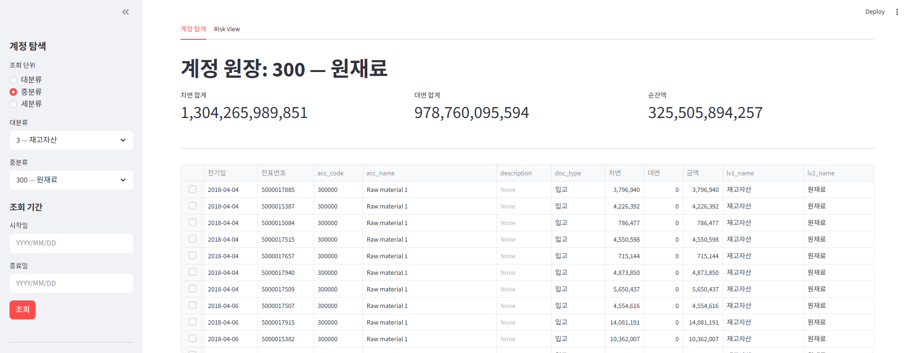
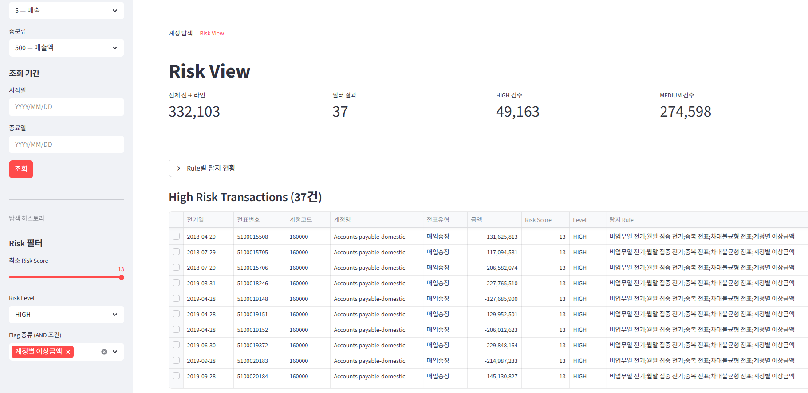

# SAP GL 기반 ERP Risk Analytics Pipeline

> 수십만 건의 GL line item 중 감사인이 어디부터 봐야 하는지를 결정할 수 있도록,  
> SAP ERP 데이터를 표준화하고 리스크 기반으로 우선순위를 부여하는 audit analytics pipeline.  
> config 교체만으로 클라이언트마다 다른 ERP 구조와 리스크 기준에 대응한다.

| 항목 | 내용 |
|------|------|
| 기간 | 2026.03.22 – 2026.05.02 |
| 유형 | 개인 (정규 스터디) |
| 담당 범위 | End-to-End (설계·구현·검증) |
| 핵심 역량 | Audit Analytics · Rule Engine · Config 추상화 |

---

## 문제 정의

공인회계사(CPA)로서 감사대상회사 제공 데이터를 다루며, 정작 시간이 많이 드는 병목이 "데이터 분석"이 아님을 경험했다. 병목은 두 곳에 있었다.

**첫째, ERP 데이터 정제.** 클라이언트마다 데이터 구조가 달라 매 engagement에서 동일한 정제가 반복된다.

- 컬럼명 — 동일 필드도 클라이언트마다 이름이 다르다
- 금액 형식 — 절대금액형(차변/대변 분리)·순금액형(+/−)·차대분리형 혼재
- 분리 테이블 — 전표 헤더(BKPF)·라인(BSEG)·계정/거래처 마스터 등 7~10개를 직접 병합

**둘째, 탐색 우선순위 결정.** 수십만 건의 전표 중 무엇을 먼저 볼지 판단에 시간이 많이 든다. "고액" threshold, "월말 집중" 일수가 engagement마다 달라 risk analytics workflow를 재사용하기 어렵다.

전통적으로는 매 현장마다 코드를 새로 짜거나 수작업으로 맞춘다. 이 프로젝트는 그 반복 구조를 재사용 가능한 파이프라인으로 해결하는 것을 목표로 했고, 모델 성능보다 **audit explainability**와 **investigation workflow**를 우선했다.

---

## 왜 이 접근을 택했는가

### 1. Rule Engine — ML 대신 Rule을 선택한 이유

감사에서 이상거래 탐지 결과는 감사 조서의 근거가 된다. 모델이 "왜 이상한가"를 설명할 수 없으면 조서에 쓸 수 없다. Rule Engine은 탐지 근거가 명확하고, 감사인이 파라미터를 직접 해석하고 조정할 수 있다.

### 2. Config 기반 설계 — 코드와 파라미터를 분리한 이유

`config_clean.yaml`은 컬럼 매핑과 금액 형식을, `anomaly_config.yaml`은 Rule 파라미터와 가중치를 담는다. 새 클라이언트 적용 시 코드는 건드리지 않고 config만 교체한다. Rule 추가 시 함수 1개 + config 항목 1개만 작성하면 파이프라인 전체에 반영된다.

### 3. 계정 계층 자동 생성 — 완전한 CoA 없이 적용 가능하게

SAP 계정코드는 앞 1~2자리가 대분류를 나타내는 Prefix 구조를 갖는다. 이를 이용해 완전한 계정과목표(Chart of Accounts) 없이도 대/중/세분류 계층을 자동 생성한다. 계정과목표가 제공되지 않는 현장에도 바로 적용할 수 있다.

---

## 핵심 설계 및 검증

### 시스템 구성

```
Raw SAP 7-table Export
        │
        ▼
    [Merge]  7개 테이블 병합 → 단일 GL master
        │
        ▼
    [Clean]  config_clean.yaml 기반 컬럼 표준화 · 파생변수 생성
        │
     ┌──┴────────────────────────────┐
     ▼                               ▼
[Anomaly Detection]          [Excel Working Paper]
anomaly_config.yaml          계정별 원장 조서 (3시트)
8개 Rule → Risk Score
     │
     ▼
[Streamlit UI]
계정 탐색 / Risk View
```

| 기능 | 설명 |
|---|---|
| 전표 드릴다운 UI | 계정 계층 → 원장 → 전표 분개 → 상대 계정 이동 (탐색 히스토리 포함) |
| Excel 조서 출력 | CONFIG 셀 1개 수정 → 원장 + 월별집계 + 유형별집계 3시트 자동 생성 |

### 이상탐지 Rule

감사 리스크 관점에서 설계한 8개 Rule. 8개 카테고리는 **내부통제 우회 · 기간 귀속 조작 · 이중 처리 · 무결성 오류 · 계정별 이상치**의 5개 리스크 축으로 매핑된다. 각 Rule은 `anomaly_config.yaml`의 파라미터로 독립 제어된다.

<details>
<summary>Rule 8개 상세 (감사 관점 의미 · 탐지 기준)</summary>

| Rule | 감사 관점 의미 | 탐지 기준 |
|---|---|---|
| Weekend Posting | 내부통제 우회 의심 전기 | 토·일 전기일 |
| Month-end Concentration | 기간 귀속 조작 가능성 | 월말 마지막 N일 집중 전기 |
| Reversal Entry | 원상복구 패턴 (전기 취소) | Reversal flag 전표 |
| Duplicate Journal | 이중 처리 의심 | 동일 전표번호·라인 중복 |
| Unusual Round Amount | 가공 거래 의심 | 설정 단위(기본 100만 원)의 배수 금액 |
| Large Manual Entry | 수동 전기 고위험 거래 | 특정 전표유형 + threshold 초과 |
| Debit-Credit Imbalance | 전표 무결성 오류 | 전표 내 차대 불일치 |
| Account-level Outlier | 계정별 비정상 금액 | 계정 내 Z-score 임계값 초과 |

</details>

### 감사 워크플로

감사인이 실제로 쓰는 흐름은 4단계로 압축된다.

```
1. Config 설정          컬럼명 · 금액 형식 · Rule threshold를 YAML로 지정
        ↓
2. GL 정제·표준화       7개 테이블 병합 → 컬럼 표준화 → 파생변수 생성
        ↓
3. Rule Engine 실행     8개 Rule → 전표 라인별 Risk Score / Level 산출
        ↓
4. High-risk 우선 탐색   Risk View 필터로 검토 대상 압축 → 전표 드릴다운 → Excel 조서 출력
```

### 동작 예시

<table>
<tr>
<td align="center" width="50%">
<br/>
<sub>계정 탐색</sub>
</td>
<td align="center" width="50%">
<br/>
<sub>Risk View</sub>
</td>
</tr>
</table>


---

## 주요 결과

단일 SAP 샘플(1 engagement, 332,103개 GL line items)에서 **8 Rule × 3-layer Config로 전체 파이프라인 재사용성을 검증**했다.

- 차대불균형 전표 **21,374건** 탐지 (전표 무결성 검증)
- 계정별 이상금액(Z-score 3σ 초과) **2,068건**, 20개 계정에서 탐지
- 8개 Rule 전 단계 정상 실행 · Excel 조서 자동 출력 확인 — CONFIG 셀 1개 교체로 원장·월별·유형별 3시트 자동 생성

> ※ 검증용 공개 SAP 샘플 특성상 중복전표(Duplicate Journal)·차대불균형(Debit-Credit Imbalance) Rule은 데이터 품질 이슈에 민감. 실제 client 적용 시 threshold calibration·rule weighting 통해 대응.

---

## 기여 내역

개인 프로젝트로, 설계부터 구현·검증까지 전 범위를 단독 수행했다.

- **감사 병목의 재정의** — anomaly detection이 아닌 *탐색 우선순위* 문제로 프레이밍. 모델 성능 대신 audit explainability를 KPI로 채택
- **Config 추상화 레이어 설계·구현** — 컬럼·금액 형식·Rule threshold를 전부 YAML로 분리해 새 클라이언트는 코드 수정 없이 config 교체로 대응
- **Rule 설계 (감사 리스크 축 5개)** — 내부통제 우회·기간 귀속 조작·이중 처리·무결성 오류·계정별 이상치 5개 축에서 8 Rule 도출, 각 Rule의 가중치 체계 수립
- **계정 계층 자동 생성** — 완전한 CoA 없이 SAP 계정코드 Prefix로 대/중/세분류 자동 생성
- **탐색 UX 설계** — Streamlit Risk View (계층 탐색 → 전표 drill-down → 상대 계정 이동 → Excel 조서 export)

---

## 한계 및 향후 개선

- **단일 데이터셋 검증** — 모든 설정이 1개 SAP 샘플 기준. 다중 클라이언트 config 재사용성 미검증
- **공개 샘플 데이터 특성 · Rule 민감도** — 검증용 공개 SAP 샘플의 split posting·synthetic artifact 등으로 중복전표(Duplicate Journal)·차대불균형(Debit-Credit Imbalance) Rule이 데이터 품질 이슈에 민감했다. 실제 client 적용 시 threshold calibration 및 rule weighting을 통해 대응 (production-ready 전환 과제)
- **B형(순금액형) 미검증** — 입력 경로는 설계 완료, 실 데이터 테스트 없음
- 향후: 다중 클라이언트 데이터로 config 재사용성 검증, Rule별 threshold 자동 calibration

---

> 상세 설계 및 검증 기록: [`docs/`](docs/)
